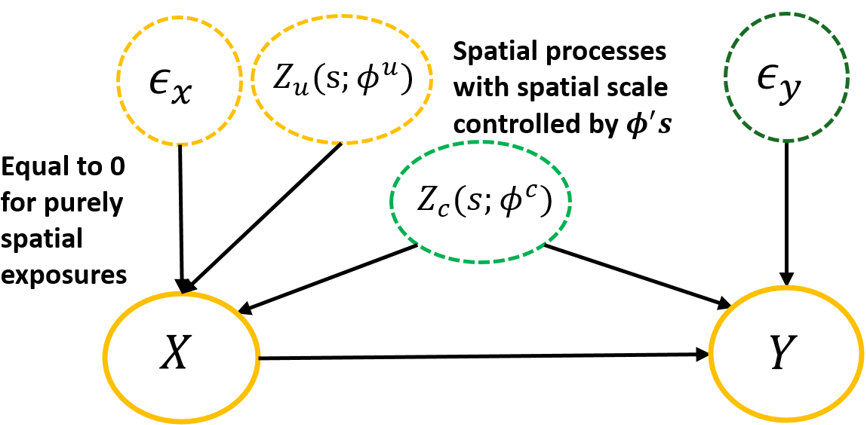
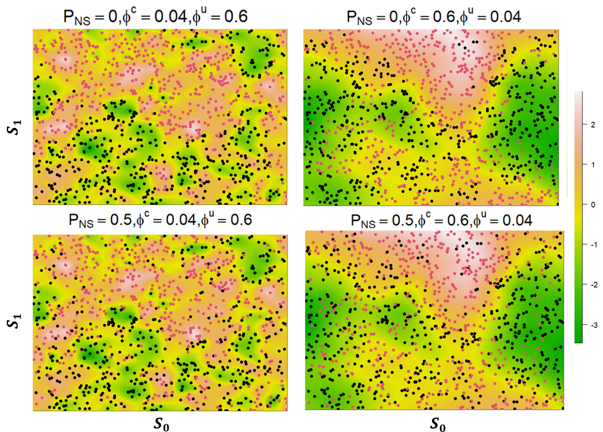
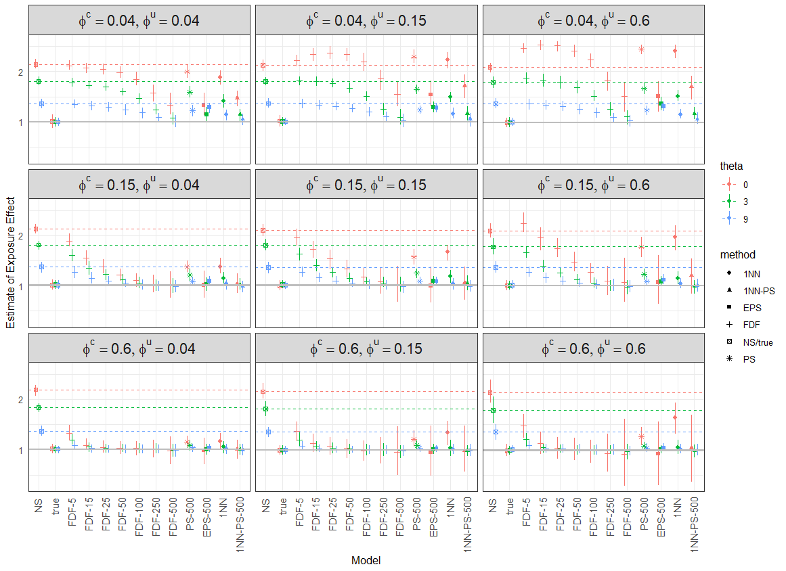
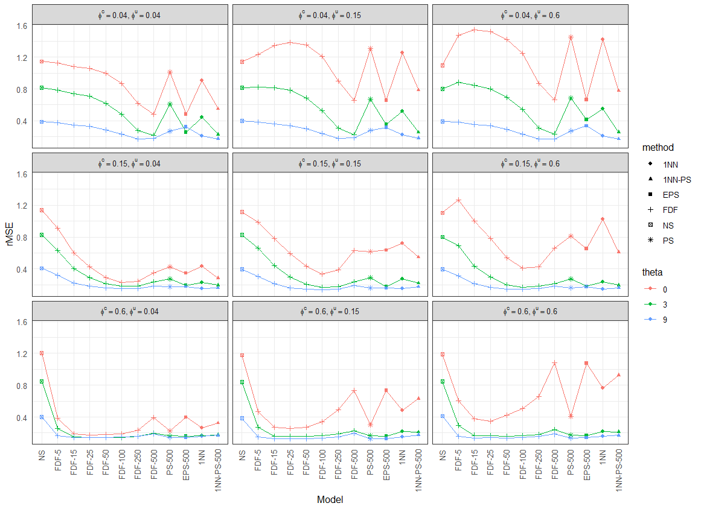
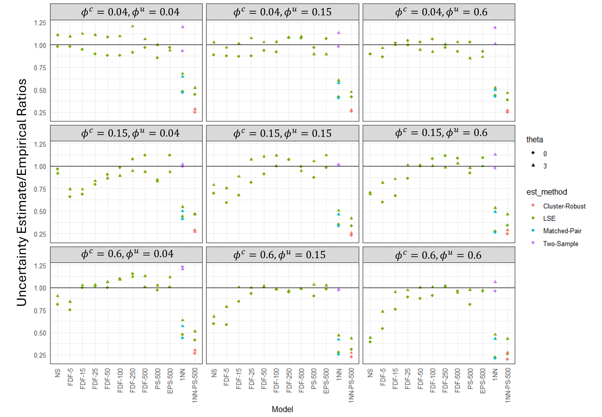
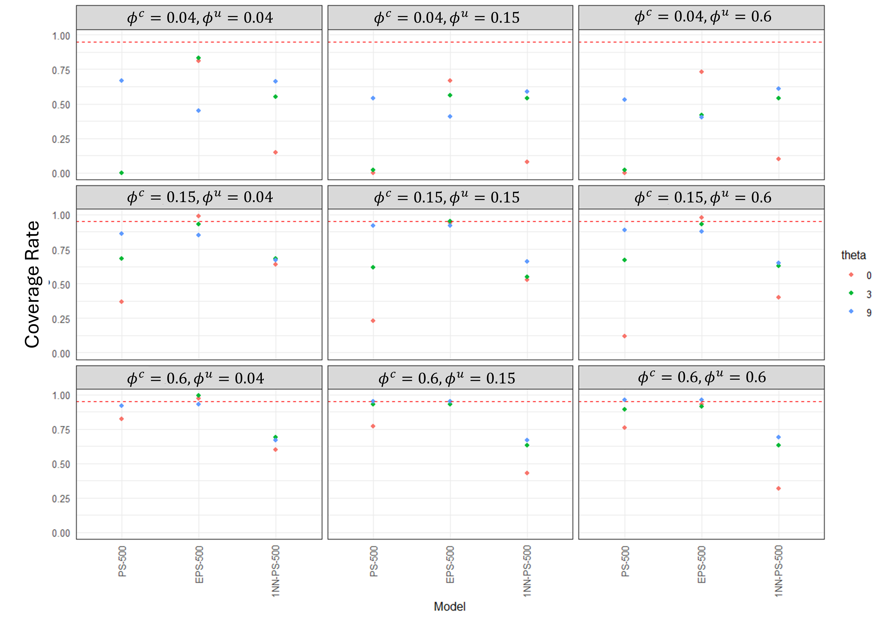

Bias Amplification under Spatial Confounding
================

- [Introduction](#introduction)
- [Project structure](#project-structure)
- [Causal diagram (DAG)](#causal-diagram-dag)
- [Data-generating scenarios (major
  code)](#data-generating-scenarios-major-code)
- [Simulation: fit models + summarize (major
  code)](#simulation-fit-models--summarize-major-code)
- [Model performance visualization](#model-performance-visualization)
- [Bias exacerbation through adjustering for intrumental
  variable](#bias-exacerbation-through-adjustering-for-intrumental-variable)

## Introduction

This repository studies **bias amplification** in spatial regression
under **unmeasured spatial confounding**. We simulate spatial data under
multiple scenarios and compare estimation strategies in terms of bias,
uncertainty quantification (e.g., coverage), and overall error. More
details can be find in the paper Li D, Cruz M, Mooney SJ, Cook AJ, Bobb
JF (2025). **Mitigating the risk of bias exacerbation when controlling
for unmeasured spatial confounding for binary exposures.** *American
Journal of Epidemiology*, kwaf248.

------------------------------------------------------------------------

## Project structure

- `R/` contains helper functions:
  - data generation for spatial scenarios
  - spatial mapping function for generated exposure-confounding surface
  - preprocess function for matching methods
  - performance summary (bias, variance estimator, coverage, rMSE, etc.)
- This README embeds **major pipeline code** (high-level calls), while
  helper implementations remain in `R/`.

``` r
## required packages
library(rlist)
library(magrittr)
library(tidyverse)
library(stringr)
library(sp)
library(geoR)
library(gridExtra)
library(fields)
## packages for parallel computation can be omitted if an alternative computation strategy is used
#library(parallel)
#library(doParallel)
#library(foreach)
#library(doRNG)
## helper functions
R.files <- list.files("R", full.names = TRUE, pattern = "\\.R$")
invisible(lapply(R.files, source))
```

------------------------------------------------------------------------

## Causal diagram (DAG)

The DAG below summarizes the assumed data-generating mechanism.



------------------------------------------------------------------------

## Data-generating scenarios (major code)

This section demonstrates the first few studied scenarios, data
generation procedure, and the main code that generates synthetic
datasets.

The data generation procedure is: $$
\begin{align*}
     X_i^{\prime} &= \delta_cZ_c(s_i;\phi^c) + \delta_uZ_u(s_i;\phi^u) + \theta\epsilon_i^x, \quad X_i = I(X_i^{\prime} > x_0),
     \quad i=1,\ldots,n\\
    Y_i &= X_i+ Z_c(s_i;\phi^c)+ \epsilon_i^y.
\end{align*}
$$ The non-spatial proportion of the exposure is defined as
$P_{NS} = \theta^2/(\theta^2 + \delta_c^2 + \delta_u^2)$. The cutoff
$x_0$ controls the overall prevalence of the exposure. In the main
study, we set it as 0 to create a balanced exposure scenario for
estimating the ATE. We also conducted additional sensitivity analyses;
details are provided in the paper.

    ## # A tibble: 6 × 8
    ##   n_obs phi_c phi_u theta beta_true delta_c delta_u   Pns
    ##   <dbl> <dbl> <dbl> <dbl>     <dbl>   <dbl>   <dbl> <dbl>
    ## 1   100  0.04  0.04     0         1    2.12    2.12   0  
    ## 2   100  0.04  0.04     1         1    2.12    2.12   0.1
    ## 3   100  0.04  0.04     3         1    2.12    2.12   0.5
    ## 4   100  0.04  0.04     9         1    2.12    2.12   0.9
    ## 5   100  0.04  0.15     0         1    2.12    2.12   0  
    ## 6   100  0.04  0.15     1         1    2.12    2.12   0.1

This a demo code of simulating elementary processes
($Z_c, Z_u, \epsilon^x, \epsilon^y$) using a specific set of parameters
and Matern covariance function in Gaussian process:

``` r
#output_root <- getwd()
message(output_root)
message(n_datasets)
message(Sys.time())

cl <- makeCluster(4)
registerDoParallel(cl)
output_dir <- paste0(output_root, "/datasets_sim/")
dir.create(output_dir, recursive = TRUE, showWarnings = FALSE)
full_time0 <- Sys.time()
running_info <- tibble(n = 1024, full_time0, 
                       n_cluster = length(cl),
                       R_version = version %>% list())
if (SAVE_RUNNING_INFO) saveRDS(running_info, file = paste0(output_dir, "/runtime.rds"))
df_sim <- foreach(
    i = 1:n_datasets, .combine='bind_rows', .multicombine = TRUE, 
    .options.RNG = seed0,
    .inorder=FALSE,
    .verbose=FALSE,
    .errorhandling = "remove",
    .packages=c("magrittr", "tidyverse")) %dorng% {
        devtools::load_all()
      
        ## seeds
      seed_dataset <- 100*i
      set.seed(seed_dataset)

      df <- gen_data_comps(size = 1, n_obs = 1000, phi_seq = c(0.04, 0.15, 0.6),
                           sigsq_y_true_seq = 4, mat_corfun=mat_corfun_matern)
      out <- tidyr::crossing(dataset = i, seed_dataset, df)
      saveRDS(out, file = paste0(output_dir, i, ".rds"))
        
      out
    }
full_time1 <- Sys.time()
stopCluster(cl)
difftime(full_time1, full_time0)
running_info %<>% mutate(full_time1 = full_time1)
if (SAVE_RUNNING_INFO) saveRDS(running_info, file = paste0(output_dir, "/runtime.rds"))
```

The functions used to assemble the elementary processes into $X$ and $Y$
are in `R/generate_data.R`. The function `gen_data_from_comps` generates
data according to the equations above. The function
`gen_data_from_comps_Zy` coupled with `gen_data_comps_phiY` adds an
additional unconfounded spatial process $Z_y$ to the outcome (i.e.,
$Y_i = X_i+ Z_c(s_i;\phi^c)+ Z_y(s_i;\phi^y)+\epsilon_i^y$), for which
we included additional experiments and the results are reported in the
supplementary materials.we did additional studies and results are in the
supplementary materials.

### Spatial visualization of the scenario

Using a generated data, the relative spatial distribution of the binary
exposure and corresponding latent confounding surface can be visualized
using the function `surface_kc` in `R/make_plots.R`. Here we demonstrate
four typical data scenarios in our study:

``` r
dataset_id <- 1
df_comps <- readRDS(paste0(output_root,"/datasets_sim/",
                           dataset_id,".rds"))
pred.grid <- expand.grid(seq(0,1,l=400),seq(0,1,l=400))
P = c(0, 0.5) #Non-spatial proportion Pns
par(mfrow=c(2,2))
for (p in P) {
  df1 <- gen_data_from_comps(df_comps, beta=1, deltaE=NULL, coef_gen_y=1, 
                             coef_gen_c = sqrt(9/2), coef_gen_u=sqrt(9/2),
                             coef_inter=0,thresh=0, Pns=p, phi_c=0.6, phi_u=0.04,sigsq_y_true=4)
  df2 <- gen_data_from_comps(df_comps, beta=1, deltaE=NULL, coef_gen_y=1, 
                             coef_gen_c = sqrt(9/2), coef_gen_u=sqrt(9/2),
                             coef_inter=0,thresh=0, Pns=p, phi_c=0.04, phi_u=0.6,sigsq_y_true=4)
  if(p==0){
    expr = expression(paste(Pns==0,",",phi^c == 0.6,",", phi^u == 0.04))
    surface_kc(df1, "z_c", ini=c(1,0.6), pred.grid, expression = expr, 
               file.path = paste0(output_root,"/map/","data",dataset_id,"_phic",0.6,
                                  "_phiu",0.04,"_Pns",p,".rds"))
    expr = expression(paste(Pns==0,",",phi^c == 0.04,",", phi^u == 0.6))
    surface_kc(df2, "z_c", ini=c(1,0.04), pred.grid, expression = expr,
               file.path = paste0(output_root,"/map/","data",dataset_id,"_phic",0.04,
                                  "_phiu",0.6,"_Pns",p,".rds"))
  }else{
    expr = expression(paste(Pns==0.5,",",phi^c == 0.6,",", phi^u == 0.04))
    surface_kc(df1, "z_c", ini=c(1,0.6), pred.grid, expression = expr,
               file.path = paste0(output_root,"/map/","data",dataset_id,"_phic",0.6,
                                  "_phiu",0.04,"_Pns",p,".rds"))
    expr = expression(paste(Pns==0.5,",",phi^c == 0.04,",", phi^u == 0.6))
    surface_kc(df2, "z_c", ini=c(1,0.04), pred.grid, expression = expr,
               file.path = paste0(output_root,"/map/","data",dataset_id,"_phic",0.04,
                                  "_phiu",0.6,"_Pns",p,".rds"))
  }
}
```



------------------------------------------------------------------------

## Simulation: fit models + summarize (major code)

Models in comparison includes: - Non-spatial model which serves as a
baseline model (NS) - true model where Zc is assumed known (true) -
fixed DF spline models with $K=5,10,25,50,100,250,500$ (FDF-K) -
Penalized spline with $K=250, 500$ (PS) - Generalized exposure-penalized
spline with $K=250, 500$ (E-PS) - one-to-one pair matching with
replacement (1NN) w./w.o. caliper - 1NN combined with a PS model with
$K=500$ (1NN-PS-500) w./w.o. caliper - Full matching (FULL) - Full
matching combined with a PS model with $K=500$ (FULL-PS-500) (Detailed
description of each method can be found in the paper.) Methods were
evaluated based on their empirical bias, variance, root mean square
error, and accuracy of uncertainty quantification (e.g., variance
estimation, cover rate).

``` r
model_info <- bind_rows(
    tibble(class = "Non-spatial", method = "SLR", saveDir = "NS"),
    tibble(class = "True-model", method = "true", saveDir = "true"), # true model assuming Zc is observed
    tibble(class = "Spatial spline", method = "fix_df", Knots = c(5, 10, 25, 50, 100, 250, 500)) %>%
      mutate(saveDir = paste0("FDF_", Knots)),
    tibble(class = "Spatial spline", method = "est_df_y", Knots = c(250, 500)) %>%
      mutate(saveDir = paste0("PS_", Knots)),
    tibble(class = "Spatial spline", method = "est_df_x", Knots = c(250, 500)) %>% 
      mutate(saveDir = paste0("EPS_", Knots)),
    tibble(class = "1NN", method = "SRL", Caliper = c(0, 0.08, 0.15, 0.6)) %>%
      mutate(saveDir = ifelse(Caliper == 0, "oneNN", paste0("1NN_", Caliper))),  # caliper applied to prevent poor match
    tibble(class = "full", method = "SRL", saveDir = "FULL"),
    tibble(class = "1NN", method = "est_df_y", Knots = c(500), Caliper = c(0, 0.08, 0.15, 0.6)) %>%
      mutate(saveDir = ifelse(Caliper == 0, "oneNN_PS_500", paste0("1NN_PS_500_", Caliper))),
    tibble(class = "full", method = "est_df_y", Knots = c(500), saveDir = "FULL_PS_500")
)
model_info
```

    ## # A tibble: 23 × 5
    ##    class          method   saveDir Knots Caliper
    ##    <chr>          <chr>    <chr>   <dbl>   <dbl>
    ##  1 Non-spatial    SLR      NS         NA      NA
    ##  2 True-model     true     true       NA      NA
    ##  3 Spatial spline fix_df   FDF_5       5      NA
    ##  4 Spatial spline fix_df   FDF_10     10      NA
    ##  5 Spatial spline fix_df   FDF_25     25      NA
    ##  6 Spatial spline fix_df   FDF_50     50      NA
    ##  7 Spatial spline fix_df   FDF_100   100      NA
    ##  8 Spatial spline fix_df   FDF_250   250      NA
    ##  9 Spatial spline fix_df   FDF_500   500      NA
    ## 10 Spatial spline est_df_y PS_250    250      NA
    ## # ℹ 13 more rows

``` r
iter_info <- tidyr::crossing(
  dataset = 1:n_datasets,
  phi_c = c(0.04,0.15,0.6),
  phi_u = c(0.04,0.15,0.6),
  P = c(0, 0.5, 0.9),
  coef_c = sqrt(9/2),
  coef_u = sqrt(9/2),
  model_info
) %>%
  mutate(iter = row_number()) %>%
  dplyr::select(iter, dataset, everything())
```

Here we show the code for running each simulation iteration after
merging the dataset information with the model specifications.

- Note: For matching methods, use the `Matchit_list` function in
  `R/matchit.R` to preprocess the data to (1) create replicates for
  matching with replacement, (2) assign subclass membership for the
  cluster-robust variance estimator (CRVE), and (3) compute weights for
  weighted least squares estimation (WLS). Variance estimators are
  handled as follows: (1) standard least squares, the sandwich
  estimator, and CRVE are computed using `extract_ests_gam` in
  `R/extract_ests_gam.R`; (2) for 1NN, we additionally implemented the
  two-sample variance estimator and the matched-pair variance estimator
  directly in the code below.

``` r
cl <- makeCluster(detectCores() - 1)
registerDoParallel(cl)
dir.create(output_root, recursive = TRUE, showWarnings = FALSE)
full_time0 <- Sys.time()
res <- foreach(
    i = 1:nrow(iter_info), .combine='bind_rows', .multicombine = TRUE, 
    .options.RNG = seed0,
    .inorder=FALSE,
    .verbose=FALSE,
    .errorhandling = "remove",
    .packages=c("magrittr", "tidyverse","lmtest",
                "mgcv","MatchIt","Rcpp","optmatch","sandwich")) %dorng% {
        devtools::load_all()
        suppressWarnings(rm(list = ls() %>% setdiff(c("iter_info", "i", "SAVE_ROUT", "output_root"))))
        gc()

        res0 <- iter_info[i, ]
        iter <- res0$iter
        stem <- iter
        
        output_dir <- paste0(output_root, "/",res0$saveDir,"/")
        dir.create(output_dir, recursive = TRUE, showWarnings = FALSE)
        if (SAVE_ROUT) {
            sink(Rout_file)
        }
        
        ## Scenario
        cat("\n\nScenario:\n")
        glimpse(res0)
        
        ## Load in data and assmebly according to designed data scenario ####
        cat("\n\nGenerating data:\n")
        df_comps <- readRDS(paste0(output_root,"/datasets_sim/", res0$dataset, ".rds"))
        
        df <- res0 %$% gen_data_from_comps(df_comps, beta=1, deltaE=delta, coef_gen_y=1, 
                                           coef_gen_c = coef_c, coef_gen_u=coef_u,
                                           coef_inter=0,thresh=0, Pns=P, 
                                           phi_c=phi_c, phi_u=phi_u,
                                           sigsq_y_true=4)

        if_match <- res0$class %in% c("1NN", "full")
        time0 <- Sys.time()
        ## matched data ###
        if (if_match) {
          m <-  Matchit_list(df, caliper= res0$Caliper, clp=res0$clp, 
                             rep = res0$class == "1NN", match_method = res0$class)
          if(res0$class == "1NN"){
            m <- cluster_nearest(m)
            m$df_dup$cluster_id <- m$df_dup$pair_id
          }
          df_ate <- m$df_dup
          ## weighted data ###
          df_w <- m$df_weight
          if(res0$class == "full"){
            df_w$cluster_id <- df_w$subclass
          }
        }

        ## fit model ####
        cat("\n\nFitting model:\n")
        if(res0$method == "SLR"){
          df_orig <- df
          if(res0$class != "full"){
            if(if_match){df <- df_ate}
            mod_indv <- lm(y_indv ~ X_indv, data = df)
            time1 <- Sys.time()
            s_indv <- summary(mod_indv)
            summ0 <- s_indv$coefficients["X_indv",] %>%
              set_names(c("ATE_est", "ATE_se", "indv_t", "indv_p")) %>% 
              as.list() %>%
              as_tibble() %>%
              mutate(param = "coef_x",
                     coef_se_rob = sqrt(sandwich::sandwich(mod_indv)[2, 2]),
                     bic = BIC(mod_indv), time0=time0, time1=time1)
            res_mod <- summ0
          }
        
          if(if_match) {
            if(res0$class == "full"){
              mod_indv_w <- lm(y_indv~X_indv, data = df_w, weights = df_w$weights)
              time1 <- Sys.time()
              time2 <- time3 <- time1
              s_w <- summary(mod_indv_w)
              D_se <- 0
              t_se <- 0
              res_mod <- c(time0=time0, time1=time1) %>% as.list() %>% as_tibble()
            } else {
              ## 1NN
              mp_diff <- df_orig$y_indv[m$index.treated] - df_orig$y_indv[m$index.control]
              n_match <- length(m$index.treated)
              D_se <- sqrt(sum((mp_diff - mean(mp_diff))^2)/((n_match-1)*n_match))
              D_se <- sd(mp_diff)
              trt_ut <- df_orig$y_indv[unique(m$index.treated)]
              crl_uc <- df_orig$y_indv[unique(m$index.control)] 
              
              w_trt=table(m$index.treated);w_crl=table(m$index.control)
              t_s2 <- var(trt_ut)*sum(as.numeric(w_trt)^2)/sum(as.numeric(w_trt))^2 +
                var(crl_uc)*sum(as.numeric(w_crl)^2)/sum(as.numeric(w_crl))^2
              t_se <-sqrt(t_s2)
            }
            
            res_mod <- c(D_se) %>% set_names("MPE")
          }
        } else if (res0$method == "true") {
          mod_indv <- lm(y_indv ~ X_indv + z_c, data = df)
          time1 <- Sys.time()
          s_indv <- summary(mod_indv)
          summ0 <- s_indv$coefficients["X_indv",] %>%
              set_names(c("ATE_est", "ATE_se", "indv_t", "indv_p")) %>%
              as.list() %>% as_tibble() %>%
              mutate(param = "coef_x",
                     coef_se_rob = sqrt(sandwich::sandwich(mod_indv)[2, 2]),
                     bic = BIC(mod_indv))
            res_mod <- tibble(software = "lm") %>% crossing(summ0)
        } else if (res0$method == "fix_df") {
          k <- res0$Knots + 1 ##for some reason 'k' knots translates to 'k-1' edf when looking at the "Approximate significance of smooth terms"
          mod_indv <- gam(y_indv ~ X_indv + s(p0, p1, k = k, fx = TRUE), data = df)
          time1 <- Sys.time()
          summ0 <- extract_ests_gam(mod_indv, inter=FALSE, coef = "X_indv")
          res_mod <- summ0 %>% 
            mutate(param = "coef_X",software = "gam", time0 = time0, time1 = time1)
        } else if (res0$method == "est_df_x") {
          k <- res0$Knots 
          time0 <- Sys.time()
          mod_indv_x <-  gam(X_indv ~ s(p0, p1, k = k), data = df, family=binomial)
          
          timex <- Sys.time()
          mod_indv <-  gam(y_indv ~ X_indv + s(p0, p1, k = k), data = df,
                           sp = mod_indv_x$sp)
          time1 <- Sys.time()
          summ0 <- extract_ests_gam(mod_indv, inter=FALSE, coef = "X_indv")
      
          res_mod <- summ0 %>% 
            mutate(param = "coef_X",software = "gam", time0 = time0, timex = timex, time1 = time1)
          
        } else if (res0$method == "est_df_y") {
          cluster_ind = FALSE
          if(res0$class != "full"){
            if(if_match){df <- df_ate; cluster_ind <- TRUE}
            k <- res0$Knots
            mod_indv <- gam(y_indv ~ X_indv + s(p0, p1, k = round(k,0)), 
                            data = df)
            time1 <- Sys.time()
            summ0 <- extract_ests_gam(mod_lat, inter=FALSE, coef = "X_indv", 
                                      cluster = cluster_ind, match_data = df)
            res_mod <- summ0 %>% 
            mutate(param = "coef_X",software = "gam", 
                   time0 = time0, time1 = time1)
          }
          
          if(if_match){
            time2 <- Sys.time()
            k <- dim(df_w)[1]/2
            mod_indv_w <- gam(y_indv ~ X_indv + s(p0, p1, k = round(k,0)), 
                              data = df_w, weights = df_w$weights)
            time3 <- Sys.time()
            if(res0$class == "full"){
              time1 <- time3
              time2 <- time3 <- time1
              res_mod <- c("coef_X","gam") %>% 
                set_names(c("param","software"))%>% 
                as.list() %>% as_tibble() %>% mutate(time0 = time0, time1 = time1)
              cluster_ind <- TRUE # computing cl_stde
            }
            
            summ_w <- extract_ests_gam(mod_indv_w, inter=FALSE, coef = "X_indv",
                                       cluster = cluster_ind, match_data = df_w)
            summ_w <- summ_w[-c(3,4)] %>%
              set_names(paste0("WLS_",colnames(summ_w)[-c(3,4)]))
            res_mod %<>% bind_cols(summ_w) %>%
              mutate(time2 = time2, time3 = time3,k=k)
          }
        } else {
          res_mod <- tibble(message = "method not available")
        }
         
        ## Save and finish ####
        cat("\n\nSaving relevant output:\n")
        res_iter <- res0 %>%
            bind_cols(res_mod)
        saveRDS(res_iter, file = paste0(output_dir, "/"
                                        res0$method, stem, ".rds"))
        
        #cat("\n\nDone!\n")
        #glimpse(res_iter)
        ## return
        if (SAVE_ROUT) {
            #sink(type = "message")
            sink()
        }
        res_iter
    }
full_time1 <- Sys.time()
stopCluster(cl)
difftime(full_time1, full_time0)
```

### Model results summary and aggregation

After concating outputs for each model/saveDir separately from above,
summarize and aggregate model results for each model under each data
scenario using functions in `R/summary.R` and `R/stat_aggregate.R`.

``` r
res_dir <- paste0(output_root,"/res_summary") # store results for each model across data scenarios and replicates
file_list <- list.files(path=res_dir)
model_name = str_remove(file_list, ".rds")
for (i in seq_along(file_list)) {
  x <- readRDS(paste0(res_dir,"/",file_list[i]))
  assign(model_name[i],x)
}
unique(model_info$saveDir)
```

``` r
res_list_constant <- list(NS, true, FDF_5, FDF_15, FDF_25, FDF_50, FDF_100, FDF_250, FDF_500, PS_500, EPS_500, oneNN, oneNN_PS_500)

model_list <- c("Naive","true_Model",rep("fdf",7),"PS", rep("EPS",1),"M1",rep("M1_comb",1))#, "M1_weight")
phi_seq = c(0.04,0.15,0.6)
theta_seq = c(0,3,9)
model_name <- c("NS","true",paste0("FDF-",c(5,15,25,50,100,250,500)),"PS-500", paste0("EPS-", c(500)),
                "1NN","1NN-PS-500")

stat <- stat_all(res_list_constant, model_list, phi_seq, phi_seq,
                           theta_seq, ATE=1, rob_need=F)  # a list containing results for each model under each data scenario
```

------------------------------------------------------------------------

## Model performance visualization

### Bias and Variability

The calculation of bias, quantiles, rMSE is through `biasRMSE` in
`R/stat_aggregate.R`.

``` r
result <- biasRMSE(stat, model_name, phi_seq, phi_seq, theta_seq)
result$model <- factor(result$model,levels = model_name) 
result %<>% mutate(phic_expr = paste0("phi^c == ", phic),
                   phiu_expr = paste0("phi^u == ", phiu)) 
```

1)  bias&variability

``` r
pch = rep(c("NS/true","NS/true",rep("FDF",7),"PS",
            rep("EPS",1),"1NN",rep("1NN-PS",1)), times = 27)

method <- as.factor(pch)
pd <- position_dodge(0.5)
result$true = rep(result$mean[result$model=="true"], each = 13)

ggplot(result, aes(x=model, y= mean, colour = theta)) +
  geom_point(aes(shape=method),position = pd) + 
  geom_linerange(aes(ymin=lb, ymax=ub, group = theta),position = pd) +
  geom_hline(aes(yintercept=NS, color=theta), linetype=2) +
  geom_hline(aes(yintercept=true, color=theta), linetype="solid", color = "gray")+
  geom_hline(yintercept=1, linetype="solid", color = "gray") +
    theme_bw()+
    labs(y="Estimate of Exposure Effect", x = "Model")+
    theme(axis.text.x = element_text(angle = 90, vjust=0.4, hjust=0.95, size = 10),
        axis.ticks = element_blank(),
        strip.text = element_text(size = 15)) +
    facet_wrap( ~ phic_expr+phiu_expr,  labeller = labeller(.cols = label_parsed, .multi_line = FALSE))
```



2)  rMSE

``` r
result2 <- result %>% filter(model != "true")
pch = rep(c("NS",rep("FDF",7),
            "PS",rep("EPS",1), "1NN", "1NN-PS"),  27)
method <- as.factor(pch)
ggplot(result2, aes(x=model, y= rMSE, colour = theta, group = theta)) +
  geom_point(aes(shape=method)) + 
  geom_line() +
  theme_bw() +
  labs(y="rMSE", x = "Model")+
  theme(axis.text.x = element_text(angle = 90, vjust=0.4, hjust=0.95),
        axis.ticks = element_blank()) +
  facet_wrap( ~ phic_expr+phiu_expr,  labeller = labeller(.cols = label_parsed, .multi_line = FALSE))
```



### Uncertanity

The variance estimators and estimated CIs are extracted or constructed
from aggregation results before using function `est_theta_se` in
`R/stat_aggregate.R`.

``` r
se_name <- c("ATE_se_emp","ATE_se_est_mean",
             "ATE_se_MP_mean",
             "ATE_se_TS_mean",#
             "ATE_cluster_se_mean")
data_se = est_theta_se(stat_se, se_name, model_name, phi_seq, phi_seq, theta=c(0,3,9))
data_se$model <- factor(data_se$model, levels = model_name)

data_se$theta <- factor(data_se$theta, levels = c("0","3","9"))
data_se_tb <- data_se
data_se_tb[,5:8] <- data_se_tb[,5:8]/data_se_tb$ATE_se_emp
data_se_tb %<>% dplyr::select(-c("ATE_se_emp"))
data_se_long <- data_se_tb %>% pivot_longer(cols = starts_with("ATE"),
                                            names_to = "est_method", values_to = "Value")
data_se_long$est_method=str_replace_all(data_se_long$est_method,c("ATE_se_est_mean"="LSE","ATE_se_MP_mean"="Matched-Pair",
                                          "ATE_se_TS_mean"="Two-Sample","ATE_cluster_se_mean"="Cluster-Robust"))

data_se_long %<>% mutate(phic_expr = paste0("phi^c == ", phi_c),
                         phiu_expr = paste0("phi^u == ", phi_u))
```

1)  SE est/SE empirical

``` r
data_se_long_select <- data_se_long %>%
  filter(model != "true", theta %in% c("0","3"))

data_se_long_select %>% 
  ggplot(aes(x = model, y=Value, color = est_method))+
  geom_point(aes(shape = theta))+
  geom_hline(yintercept = 1) +
  theme_bw() +
  labs(y="Uncertainty Estimate/Empirical Ratios", x = "Model")+
  theme(axis.text.x = element_text(angle = 90, vjust=0.4, hjust = 0.95),
        axis.ticks = element_blank()) +
   facet_wrap( ~ phic_expr+phiu_expr,  labeller = labeller(.cols = label_parsed, .multi_line = FALSE))
```



2)  Coverage rate

``` r
rate_df %<>% mutate(phic_expr = paste0("phi^c == ", phi_c),
                   phiu_expr = paste0("phi^u == ", phi_u)) 
rate_df$model = factor(rate_df$model, levels = model_name)
rate_df$theta = factor(rate_df$theta, levels = c(0,1,3,9))
ggplot(rate_df%>% filter(theta != 1),aes(x = model, y = cover_rate, group=theta, color=theta))+
    geom_point()+
  #geom_line()+
  geom_hline(yintercept = 0.95, linetype = 2, color= "red")+
  theme_bw() +
  labs(y="Coverage Rate", x = "Model")+
  theme(axis.text.x = element_text(angle = 90, vjust=0.4, hjust = 0.95),
        axis.ticks = element_blank())+
    facet_wrap( ~ phic_expr+phiu_expr,  labeller = labeller(.cols = label_parsed, .multi_line = FALSE)) 
```



------------------------------------------------------------------------

## Bias exacerbation through adjustering for intrumental variable

Evaluation of correlation between fitted spline term and $Z_u$ and $Z_c$
in spline spline models can be conducted as below (here we demonstrate
using FDF-K models):

``` r
SAVE_ROUT <- FALSE
library(parallel)
library(doParallel)
library(foreach)
library(doRNG)

cl <- makeCluster(detectCores() - 1)
registerDoParallel(cl)
dir.create(output_root, recursive = TRUE, showWarnings = FALSE)
full_time0 <- Sys.time()
res <- foreach(
    i = 1:nrow(iter_info), .combine='bind_rows', .multicombine = TRUE, 
    .options.RNG = seed0,
    .inorder=FALSE,
    .verbose=FALSE,
    .errorhandling = "remove",
    .packages=c("magrittr", "tidyverse","lmtest",
                "mgcv","MatchIt","Rcpp","optmatch","sandwich")) %dorng% {
        devtools::load_all()
        suppressWarnings(rm(list = ls() %>% setdiff(c("iter_info", "i", "SAVE_ROUT", "output_root"))))
        gc()

        res0 <- iter_info[i, ]
        iter <- res0$iter
        stem <- iter
        
        output_dir <- paste0(output_root, "/",res0$save_file,"/")
        dir.create(output_dir, recursive = TRUE, showWarnings = FALSE)
        if (SAVE_ROUT) {
            sink(Rout_file)
        }
        
        ## Scenario
        cat("\n\nScenario:\n")
        glimpse(res0)
        
        ## Load in data ####
        cat("\n\nGenerating data:\n")
        df_comps <- readRDS(paste0(output_root,"/datasets_sim/", res0$dataset, ".rds"))
        #ATE
        df <- res0 %$% gen_data_from_comps(df_comps, beta=1, coef_gen_y=1, 
                                           coef_gen_c = coef_c, coef_gen_u=coef_u,
                                           coef_inter=0,thresh=0, Pns=P, 
                                           phi_c=phi_c, phi_u=phi_u,
                                           sigsq_y_true=4)
        

        cat("\n\nFitting model:\n")
        if (res0$method == "fix_df") {
          k <- res0$Knots + 1
          mod_indv <- gam(y_indv ~ X_indv + s(p0, p1, k = k, fx = TRUE), data = df)
          
          Tmat <- predict(mod_indv, type = "terms", se.fit = FALSE)
          s_col <- grep("^s\\(p0,\\s*p1\\)$", colnames(Tmat))
          s_hat <- drop(Tmat[, s_col])
          cor_s_Zc <- cor(s_hat, df$z_c)
          cor_s_Zu <- cor(s_hat, df$z_u)
          
          summ0 <- extract_ests_gam(mod_indv, inter=FALSE, coef = "X_indv") %>% dplyr::select(c("ATE_est"))
          summ0$cor_Zc <- cor_s_Zc; summ0$cor_Zu <- cor_s_Zu
          res_mod <- summ0
        } else {
          res_mod <- tibble(message = "method not available")
        }
         
        ## Save and finish ####
        cat("\n\nSaving relevant output:\n")
        res_iter <- res0 %>%
            bind_cols(res_mod)
        saveRDS(res_iter, file = paste0(output_dir, 
                                        res0$method, stem, ".rds"))
        
        #cat("\n\nDone!\n")
        #glimpse(res_iter)
        ## return
        if (SAVE_ROUT) {
            #sink(type = "message")
            sink()
        }
        res_iter
    }
full_time1 <- Sys.time()
stopCluster(cl)
difftime(full_time1, full_time0)
```
